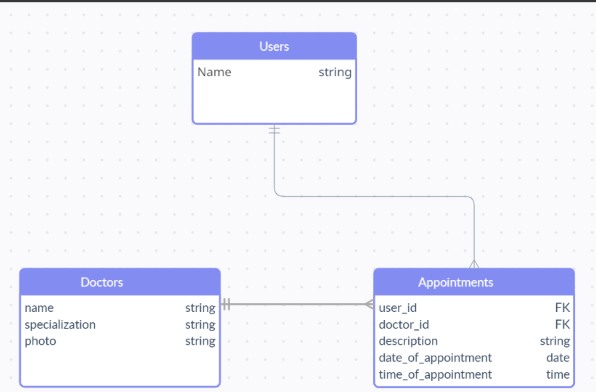

# DOCTOR APPOINTMENT BOOKING - BACKEND

> This is the backend API for the Doctor's appointment Application 

## Built With
- Ruby on Rails 
- RSpec - Testing


Project schema: 


## Link to the Frontend
[Frontend](https://github.com/TracK92/doctor-appointment-front-end)

## Link to front-end kanban board

- [Front-end kanban board](https://github.com/users/TracK92/projects/9)

### Link to back-end kanban board

- [Back-end kanban board](https://github.com/users/TracK92/projects/8/views/1)

### Link to screenshots of the kanban board

-  [Screenshots](https://github.com/TracK92/doctor-appointment-api/issues/9)

## Deployed version
[Render](https://book-doctors-appointment.onrender.com/api-docs/index.html)


## Getting Started
To get a local copy up and running follow these simple example steps.

### Prerequisites
Basic knowlwedge of computers, git and an editor most prefarably visual studio code.

- Have Ruby installed
- Have Rails installed
- Have any code editor - Prefarably Visual studio code.

### Setup
- Navigate to the directory in your local computer where you want this project to be.
- Once inside open the terminal in that directory and clone the project using the command `git clone https://github.com/TracK92/doctor-appointment-api.git` or download the file as a zip file. 

### Install
- Once you have a local copy, run teh following command to install the ruby gems 

```
bundle install
```
### Set-up Your local database

- Follow these steps to setup a local databse for your project: 

```
rails db:create
rails db:migrate
rails db:seed
```

## Authors

👤 **Tracey Kadenyi**

- GitHub: [@TracK92](https://github.com/TracK92)
- LinkedIn: [@Tracey Kadenyi](https://www.linkedin.com/in/Tracey-Kadenyi/)

👤 **Aleksandra Ujvari**

- GitHub: [@digia3d](https://github.com/digia3d)
- LinkedIn: [Aleksandra (Alex) Ujvari](https://www.linkedin.com/in/aleksandraujvari/) 
- Twitter: [@ujvari65](https://twitter.com/ujvari65)

👤 **Abby Nyakara**

- GitHub: [@AbbyNyakara](https://github.com/AbbyNyakara)
- Twitter: [@AbigaelNyakara](https://twitter.com/AbbyNyakara)
- LinkedIn: [Abigael Nyakara](https://linkedin.com/in/AbbyNyakara)

👤 **Brahim didi**

- GitHub: [@brahimdidi](https://github.com/brahimdidi)
- Twitter: [@brahimdidi](https://twitter.com/twitterhandle)
- LinkedIn: [@brahimdidi](https://linkedin.com/in/brahimdidi)

## 🤝 Contributing

Contributions, issues, and feature requests are welcome!

Feel free to check the [issues page](https://github.com/TracK92/doctor-appointment-api.git/issues).

## Show your support

Give a ⭐️ if you like this project!

## 📝 License

This project is [MIT](./MIT.md) licensed.

